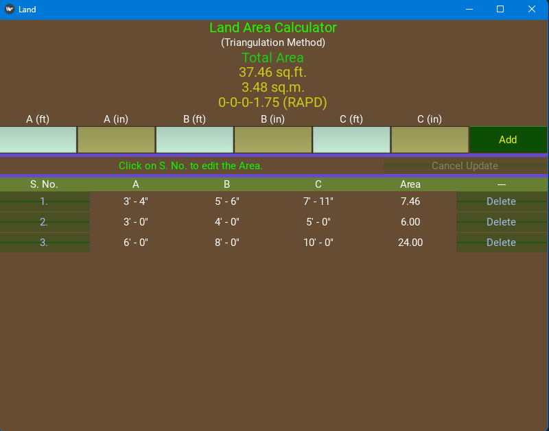

# Land Area Calculator

Simple kivy app to calculate area of land with triangulation method.

Input Units are Imperial (feet and inches).

Results are displayed in sq.ft., sq.m, and Ropani Aana Piasa Dam.

